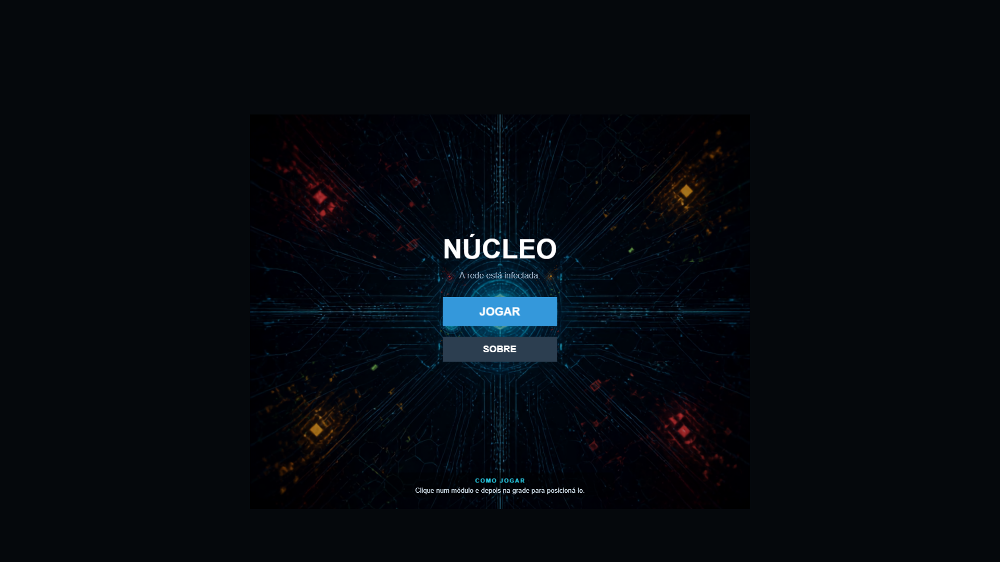

<div align="center">

# 🔷 Núcleo

### Um tower defense sobre defender o coração de uma rede contra um vírus digital


### 🎮 [Jogar agora](https://cjluc4s.github.io/nucleo-tower-defense/)

</div>

---

## Sobre

Nas profundezas da rede existe o **Núcleo** — o centro que mantém tudo funcionando. Um vírus desconhecido começou a se espalhar pelos circuitos, se manifestando em ondas de dados corrompidos que avançam por um único caminho possível: o que você controla.

Você é o **Administrador**. A cada onda, o vírus muta — fica mais rápido, mais denso, mais numeroso. Sua única defesa: erguer módulos ao longo da rota e impedir que a corrupção alcance o Núcleo.

Sem anúncios, sem compras dentro do jogo, sem conexão com servidor nenhum — só você, o navegador e a rede infectada.

## Recursos

- 🗺️ **3 setores jogáveis**, cada um com um layout de caminho próprio e complexidade crescente
- 🎚️ **3 níveis de dificuldade** por setor, cada um com sua própria economia de ouro e vidas
- ♾️ **Modo infinito** — depois de vencer um setor, continue defendendo o Núcleo indefinidamente e veja até onde consegue chegar
- 🧬 **3 tipos de vetores** (inimigos) e **3 módulos de defesa** (torres), cada um com um papel tático diferente
- 💥 Dano em área, efeitos visuais de impacto e um Núcleo que reage visivelmente a cada vazamento
- ✨ Animações discretas (surgimento, disparo, destruição) dando mais vida a vetores e módulos, sem exagero
- 🎨 Interface 100% desenhada por código — sem dependência de spritesheets ou assets externos (exceto o plano de fundo do menu)

## Capturas de tela

<div align="center">

</div>

## Como jogar

1. Escolha um **setor** (Iniciante, Intermediário ou Avançado)
2. Escolha a **dificuldade** (Fácil, Médio ou Difícil)
3. Clique num **módulo** na barra inferior, depois clique numa célula livre da grade pra posicioná-lo
4. Clique em **Iniciar Onda** quando estiver pronto
5. Impeça que os vetores alcancem o Núcleo — cada um que passar custa vidas
6. Vença todas as ondas do setor e decida: parar por ali, ou continuar no **modo infinito**

**Atalhos úteis:** `ESC`, clique direito na grade, ou clicar de novo no mesmo módulo — todos cancelam a seleção atual.

## Rodando localmente

Pré-requisitos: [Node.js](https://nodejs.org/) 18+

```bash
git clone https://github.com/cjluc4s/nucleo-tower-defense.git
cd nucleo-tower-defense
npm install
npm run dev
```

Abra `http://localhost:5173` no navegador.

Outros comandos:

```bash
npm run build    # build de produção (verifica tipos + gera dist/)
npm run preview  # serve o build de produção localmente
```

## Estrutura do projeto

```
src/
├── game/              # lógica pura do jogo, sem dependência de cena
│   ├── constants.ts   # torres, inimigos, dificuldades, curva de ondas
│   ├── maps.ts        # definição dos setores (caminho, tier, ondas, ouro)
│   ├── path.ts         # conversão grade↔pixel, cálculo de células bloqueadas
│   ├── Enemy.ts / Tower.ts / Projectile.ts
│   ├── WaveManager.ts  # spawn e progressão das ondas (inclui modo infinito)
│   └── EventBus.ts     # comunicação entre cenas
└── scenes/            # cenas do Phaser
    ├── MenuScene.ts / AboutScene.ts
    ├── MapSelectionScene.ts / DifficultyScene.ts
    ├── GameScene.ts     # gameplay principal
    └── UIScene.ts       # HUD, sobreposta ao GameScene
```

## Tecnologias

- [Phaser 3](https://phaser.io/) — engine do jogo
- [TypeScript](https://www.typescriptlang.org/)
- [Vite](https://vitejs.dev/) — dev server e build

## Roadmap

- [ ] Setor Expert (4º tier de dificuldade de mapa)
- [ ] Interferência de sinal (bloqueio de linha de visão) nos setores Avançado/Expert
- [ ] Sistema de conclusão/medalhas por setor × dificuldade
- [ ] Modificadores de desafio opcionais (ex: sem vender módulos)

## Licença

Projeto pessoal, sem licença de código aberto definida por enquanto. Sinta-se à vontade para explorar e jogar — só não redistribua sem falar comigo antes.
